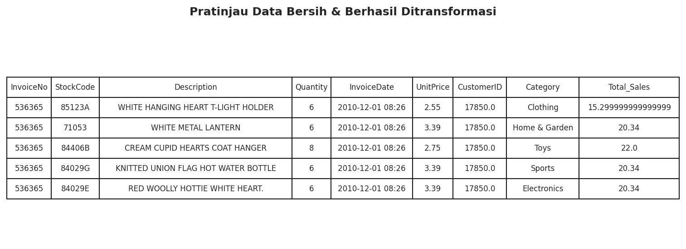
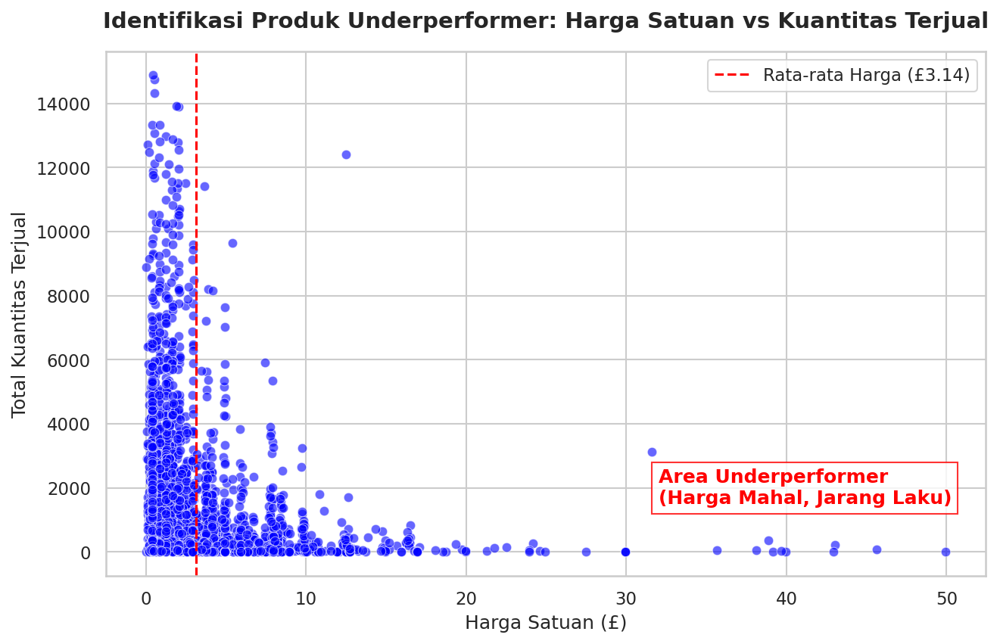
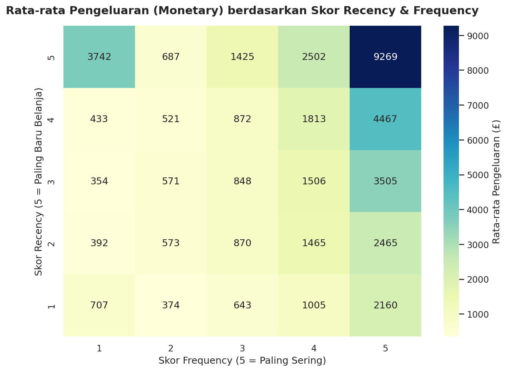
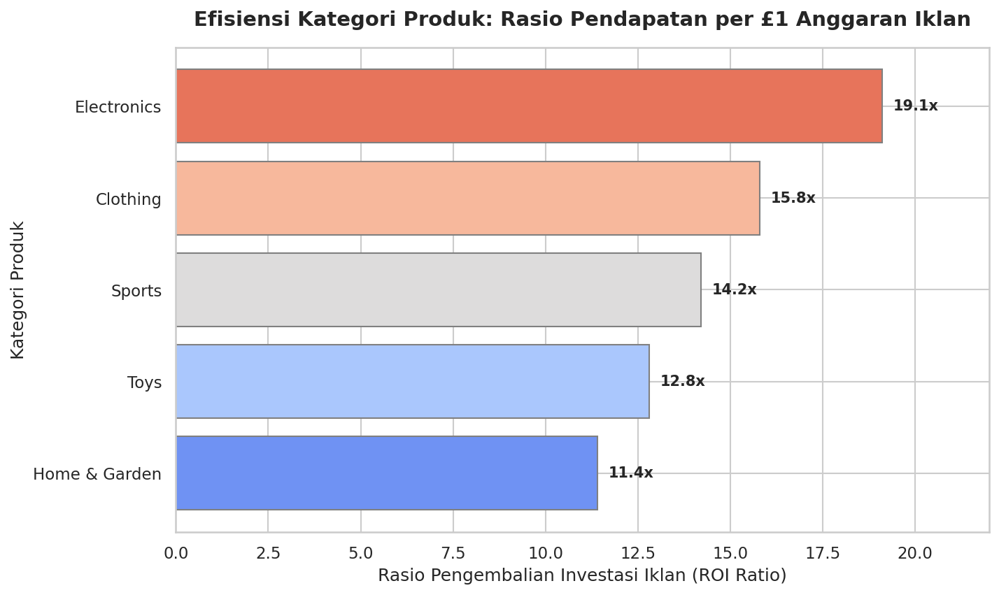

# 📊 Analisis Performa Penjualan E-commerce & Optimasi Strategi Pemasaran

Proyek ini adalah studi kasus komprehensif untuk menganalisis performa penjualan e-commerce menggunakan Python. Tujuan utamanya adalah mengekstrak *insights* dari data transaksi mentah dan memberikan rekomendasi strategi bisnis yang *actionable* guna meningkatkan profitabilitas perusahaan.

---

## 🎯 1. Business Questions
Analisis ini dirancang untuk menjawab empat pertanyaan bisnis utama:
1. **Identifikasi Inventaris:** Produk mana saja yang memiliki harga tinggi namun penjualannya rendah (membebani arus kas)?
2. **Segmentasi Pelanggan:** Siapa pelanggan terbaik dan paling loyal yang menyumbang pendapatan terbesar?
3. **Efisiensi Pemasaran:** Kategori produk mana yang memberikan tingkat pengembalian (*Return on Investment*) terbaik dari anggaran iklan yang dihabiskan?
4. **Dampak Iklan:** Apakah peningkatan anggaran iklan benar-benar menghasilkan peningkatan penjualan yang signifikan secara statistik?

---

## 🧹 2. Data Wrangling & Preparation
Sebelum melakukan pemodelan dan visualisasi, dataset diekstraksi melalui Kaggle API dan melalui tahapan *data cleaning* untuk memastikan integritas analisis.

**Proses Pembersihan yang Dilakukan:**
- **Penghapusan Anomali Transaksi:** Memfilter dan menghapus data dengan `UnitPrice <= 0` serta pesanan retur/batal (`Quantity <= 0`).
- **Pembersihan Data Pelanggan:** Menghapus baris yang tidak memiliki `CustomerID` (`dropna`), karena metrik identitas wajib untuk analisis RFM.
- **Transformasi Tipe Data:** Mengonversi kolom `InvoiceDate` menjadi format `datetime` untuk memungkinkan ekstraksi dan analisis tren berbasis waktu.
- **Feature Engineering:** Membuat kolom baru `Total_Sales` yang merupakan hasil perkalian antara `Quantity` dan `UnitPrice`.

---

## 📈 3. Insights & Visualizations

### A. Identifikasi Produk "Underperformer"

**Penjelasan:** Melalui *scatter plot* di atas, garis putus-putus merah menunjukkan rata-rata harga produk di angka £3.14. Titik-titik yang terkumpul di area kanan bawah merupakan produk **Underperformer**. Produk-produk ini memiliki harga jual yang jauh di atas rata-rata (mahal), namun mencetak volume penjualan yang sangat rendah. Hal ini mengindikasikan modal perusahaan tertahan pada inventaris yang perputarannya lambat.

### B. Segmentasi Pelanggan (RFM Analysis)

**Penjelasan:** Pelanggan dikelompokkan menggunakan metrik *Recency* (waktu belanja terakhir), *Frequency* (intensitas belanja), dan *Monetary* (uang yang dihabiskan). *Heatmap* membuktikan bahwa pelanggan di segmen Skor 5-5 (baru saja belanja dan sangat sering belanja) adalah pelanggan *Champions*. Rata-rata mereka menyumbangkan **£9,269** per orang, jauh melampaui segmen pelanggan lainnya.

### C. Analisis Kontribusi Kategori & Efisiensi Iklan

**Penjelasan:** Grafik batang di atas mengukur ROI (Pendapatan per £1 Iklan) dari masing-masing kategori produk. Terlihat bahwa **Electronics** adalah kategori paling efisien dengan tingkat pengembalian hampir 19x lipat. Sebaliknya, **Home & Garden** adalah yang paling tidak efisien, menyerap anggaran iklan yang sama namun menghasilkan rasio penjualan terendah (~11.4x).

### D. Uji Hipotesis & Analisis Prediktif (Regresi Linear)
Dari pengujian statistik harian (*output* konsol), ditemukan fakta berikut:
- **Uji Hipotesis:** Rata-rata penjualan harian saat anggaran iklan tinggi adalah **£40,541.84**, jauh mengungguli penjualan saat anggaran iklan rendah (**£17,967.64**). Peningkatan anggaran terbukti signifikan berdampak pada penjualan.
- **Model Regresi Linear ($y=\beta_{0}+\beta_{1}x+\epsilon$):** Memiliki R2 Score sebesar **0.91** (Akurasi 91%). Nilai koefisien **9.45** menunjukkan bahwa setiap penambahan £1 pada anggaran iklan (*Ad_Budget*) berkorelasi langsung dengan proyeksi kenaikan pendapatan sebesar £9.45.

---

## 💡 4. Business Recommendations
Berdasarkan *insights* data di atas, berikut adalah rekomendasi strategis untuk perusahaan:

1. **Optimalisasi Arus Kas (Inventaris):** Segera lakukan cuci gudang (*clearance sale*), *bundling*, atau diskon besar-besaran untuk produk-produk di area *Underperformer* guna mencairkan dana (modal) yang tertahan.
2. **Program Loyalitas Eksklusif:** Mengingat tingginya nilai pelanggan di segmen RFM 5-5-5, luncurkan program VIP khusus (misal: akses lebih awal ke produk baru atau gratis ongkir tanpa batas) untuk mempertahankan retensi kelompok ini.
3. **Re-alokasi Anggaran Iklan:** Pangkas sebagian anggaran pemasaran dari kategori *Home & Garden* dan alihkan pendanaan tersebut untuk memperbesar penetrasi iklan di kategori *Electronics* guna memaksimalkan margin keuntungan.
4. **Eskalasi Iklan Harian:** Karena korelasi antara iklan dan pendapatan sangat kuat dan akurat (R2: 0.91), perusahaan tidak perlu ragu untuk *scale-up* anggaran iklan secara agresif pada momentum musim liburan atau *payday sale*.

---

  <i>Data Analysis, Visualizations & Reporting by <a href="https://alfareza.site" target="_blank">Alfareza</a></i>

